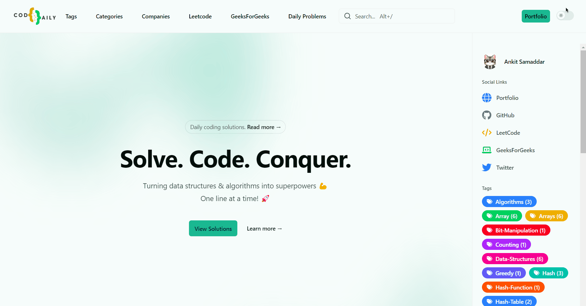
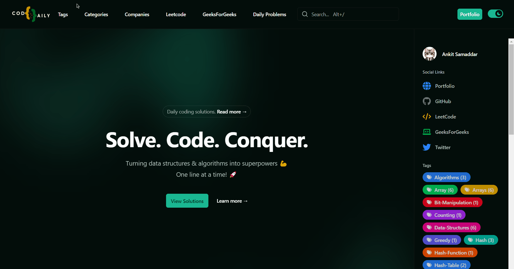
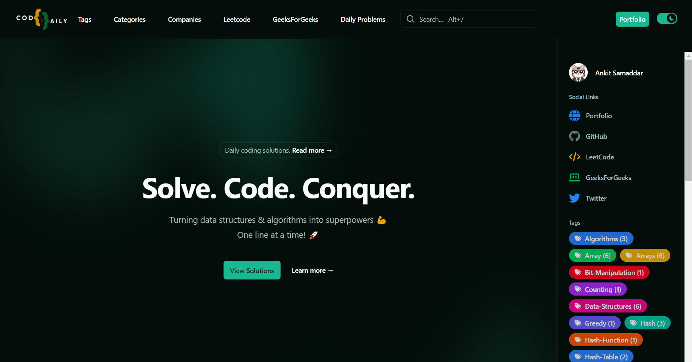
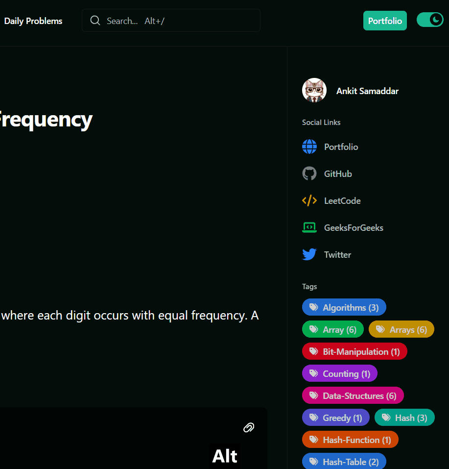
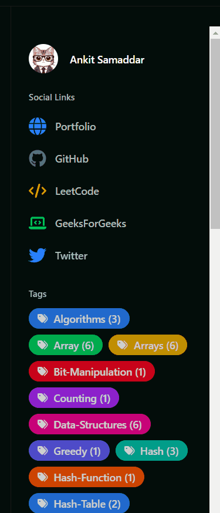

# Coding Daily

See the site live at: https://codedaily.duckdns.org/.

## Overview

This project is the **actual build** of my personal website, not the source code. Built with [Hugo](https://gohugo.io/) and styled using [Tailwind CSS](https://tailwindcss.com/), the site is a hub for sharing my daily coding journey on platforms like [LeetCode](https://leetcode.com/) and [GeeksforGeeks](https://www.geeksforgeeks.org/). It features a clean, elegant design with well-organized sections to help readers easily navigate through tags, categories, and companies. The page is enhanced with [Font Awesome](https://fontawesome.com/) icons for visual appeal and better usability.

## Features

### Home Page

- **Beautiful Layout**: A welcoming and visually appealing design with a focus on simplicity and readability.
- **Featured Content**: Highlights selected daily solutions and blog posts for quick access.

### List Pages

- **Tags**: Browse posts organized by tags (e.g., arrays, strings, dynamic programming).
- **Categories**: Explore solutions grouped into categories like Algorithms, Data Structures, etc.
- **Companies**: Filter solutions by popular company-specific questions.
- **Pagination**: Seamless pagination for long lists, ensuring smooth navigation.

### Topic Pages

- Sortable Table

  : View solutions in a sortable table with the following columns:

  - ID
  - Title
  - Difficulty
  - Date
  - Additional Columns (as required)

- **Searchable**: Quickly find a solution using keywords or filters.

### Single Page

- **Detailed View**: Each post or solution has its own page with comprehensive explanations and code snippets.
- **Code Copy Feature**: Code snippets can be easily copied with a single click.
- **Navigation Buttons**: At the bottom of each page, navigate between previous and next posts seamlessly.

### Search Bar

- **Powered by Fuse.js**: The site features a search bar implemented using Fuse.js, providing lightning-fast and fuzzy search capabilities.
- **Live Results**: As users type, results are displayed dynamically without requiring a page reload.
- **Customizable Search Parameters**: Configure weightings for fields like title, tags, and content to refine search relevance.

### Sidebar

- Social Links: Links to my various social media profiles.
- Quick Links: Access key sections like:
  - Tags
  - Categories
  - Companies
  - Recent Posts

## Technology Stack

- **Framework**: Hugo (Static Site Generator)
- **Styling**: Tailwind CSS
- **Hosting**: Github Pages
- **Other Tools**: Powershell for scrapping and content management.

## Acknowledgments

- [Hugo](https://gohugo.io/)
- [Tailwind CSS](https://tailwindcss.com/)
- [LeetCode](https://leetcode.com/)
- [GeeksforGeeks](https://www.geeksforgeeks.org/)